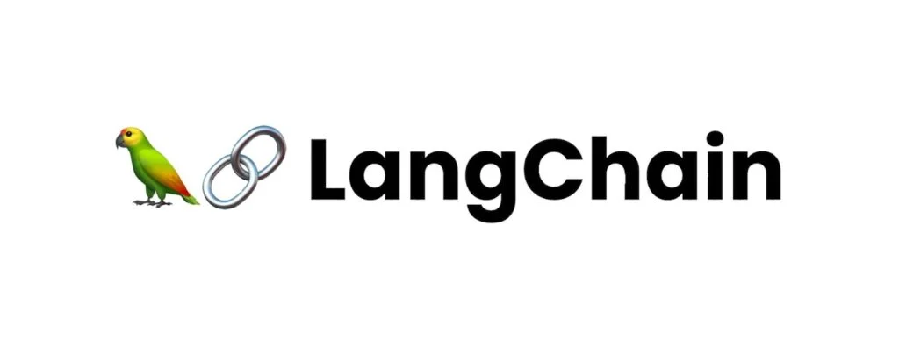
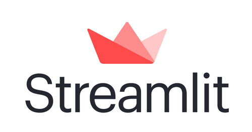

# Retrieval-Augmented Generation (RAG) with LLMs
<p align="center">
  
  
  
</p>


## Overview
This project demonstrates the implementation of a **Retrieval-Augmented Generation (RAG)** pipeline leveraging [Large Language Models (LLMs) OPENAI GPT-4](https://en.wikipedia.org/wiki/Large_language_model). RAG combines the strengths of retrieval-based systems and generative AI to create a powerful solution for answering domain-specific questions and managing large knowledge bases.

Key features of this project include:
- **Document Retrieval**: Efficient search through a custom dataset. (ChromaDB, Langchain)
- **Contextual Answering**: Using LLMs to generate answers based on the retrieved context.
- **Reasoning Architecture**: Using LLMs to guide resource selection and adding metadata filters
- **Organising VectorStore**: adding multiple sources to knowledge base.

---

## Table of Contents
1. [Project Structure](#project-structure)
2. [Prerequisites](#prerequisites)
3. [Setup Instructions](#setup-instructions)
4. [Usage Guide](#usage-guide)
5. [Customization](#customization)
6. [Architecture](#architecture)
7. [Contributing](#contributing)
8. [License](#license)

---

## Project Structure
```
📂 project-root/
├── 📂 data/                # Directory for storing documents/datasets
├── 📂 models/              # Pre-trained LLMs or embeddings
├── 📂 utils/               # Retrieval system logic (e.g., vector search, BM25)
├── 📂 vectordb/            # Code for generating responses with LLM
├── app.py                  # main file
├── README.md               # README.md descriptions and setup
└── requirements.txt        # Python dependencies
```

---

## Prerequisites
Before setting up the project, ensure you have the following:
- Python 3.8 or higher
- A working OpenAI API key (or equivalent for another LLM service)
- install neccessary libraries and frameworks specified in requirements.txt

---

## Setup Instructions

### 1. Clone the Repository
```bash
git clone https://github.com/BrainCorp/-RAG_LLM_ChatBOT.git
cd -RAG_LLM_ChatBOT
```

### 2. Install Dependencies
Create a virtual environment and install dependencies:
```bash
python -m venv venv
source venv/bin/activate   # On Windows: venv\Scripts\activate
pip install -r requirements.txt
```

### 3. Set Up API Keys
Create a `.env` file in the project root and add your API keys:
```
OPENAI_API_KEY=your_openai_api_key
```

### 4. Prepare Data
Add your documents to the `data/` folder and preprocess them:
```bash
python preprocess.py --input data/ --output processed/
```

### 5. Start the Application
Run the pipeline:
```bash
streamlit run app.py
```

---

## Usage Guide

### Querying the System
1. Interactive Query System: after `run app.py` a local server will run in default browser where we can interact with our data - QA
2. Pull up the side bar to add custom documents like - .csv, .docx, .pdf, .txt

---

## Customization

### Replace the Dataset
- Place your documents (e.g., PDFs, text files) in the `data/` folder.
- Modify the `preprocess.py` script to handle your data format.

### Add a New Retriever
- Implement your custom retriever logic in the `retriever/` folder.

---

## Architecture


The pipeline consists of:
1. **Retriever**: Fetches relevant documents using vector embeddings.
2. **Generator**: Produces answers based on the retrieved context using an LLM.
3. **Orchestrator**: Combines retriever and generator logic to process user queries.

---

## Contributing
We welcome contributions! To get started:
1. Fork the repository.
2. Create a new branch for your feature or fix.
3. Submit a pull request.

---

## License
This project is licensed under the [MIT License](LICENSE).

---

## Acknowledgments
- [OpenAI](https://openai.com/) for their LLM API.
- [LangChain](https://langchain.com/) for pipeline inspiration.
- [FAISS](https://faiss.ai/) for vector search integration.
- [ChromaDB](https://trychroma.com) for vector store and embeddings
